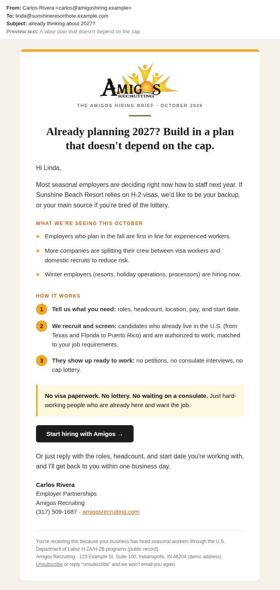
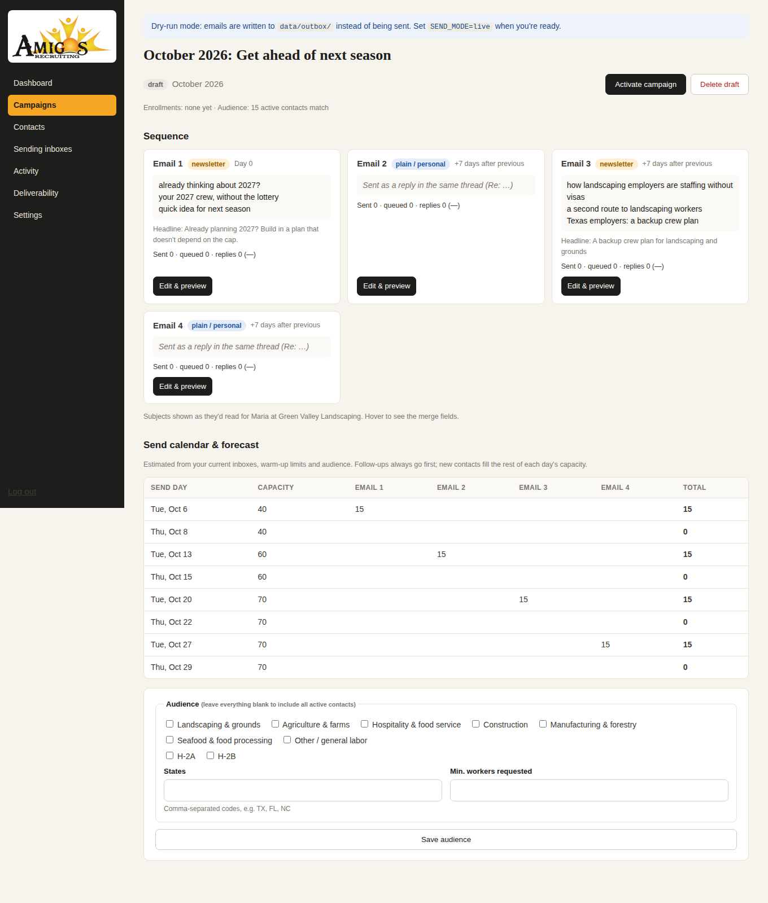

# Amigos Outreach

A cold email system built for **Amigos Recruiting**. It plans a new outreach campaign every month, writes
newsletter-style emails with the Amigos brand, sends them twice a week from several warmed-up inboxes,
and stops automatically when someone replies, bounces, or unsubscribes.

It replaces "the same email over and over from one domain", the pattern that gets a domain flagged by Gmail.

| Newsletter issue (emails 1 & 3) | Campaign planner |
|---|---|
|  |  |

## What it does

| | |
|---|---|
| **Monthly campaigns** | Each month gets its own 4-email sequence with an angle tied to the visa calendar (January: the H-2B lottery, July: second-half filings, November: plan next year…). Twelve months of copy are built in. Claude can write fresh copy each month if you add an API key. |
| **Newsletter-style design** | Emails 1 and 3 are branded issues of *The Amigos Hiring Brief* with the logo, a headline, sections, and a button. Emails 2 and 4 are short, personal-looking replies in the same thread. Those get the most responses and look the least like marketing to spam filters. |
| **Personalized for each recipient** | First name, cleaned-up company name ("GREEN VALLEY LANDSCAPING, LLC" becomes "Green Valley Landscaping"), state, and industry-specific copy (landscaping, farms, hospitality, seafood, construction, manufacturing/forestry). Subject lines rotate for A/B testing, and small wording variations mean no two emails are identical. |
| **Twice-weekly sending** | Tuesday and Thursday by default, spread across the business day one email at a time, with randomized gaps. Follow-ups go out at least 7 days apart and always from the same inbox, so the conversation stays in one thread. |
| **Multiple inboxes + warm-up** | Add as many sending inboxes as you like. Each one ramps up from 10 emails/day, adding 10 per week, up to its cap. Load is balanced across inboxes. |
| **Built for DOL H-2A / H-2B lists** | Import the Department of Labor disclosure files directly (saved as CSV). Columns are detected automatically. Repeated cases are merged, visa agents' and attorneys' addresses are skipped, and dead domains are dropped before they can bounce. |
| **Reply, bounce & unsubscribe handling** | An inbox monitor reads each inbox over IMAP. Replies stop the sequence and show on the dashboard. Bounces are suppressed. "Remove me" replies, the unsubscribe link, and Gmail's one-click unsubscribe button all add the address to the do-not-contact list for good. |
| **Safety rails** | Dry-run mode by default. Won't send without a postal address (CAN-SPAM). Caps emails per company domain per day. Pauses an inbox on login or rate-limit errors. Pauses everything if bounces go over 4%. DNS checker for SPF, DKIM, and DMARC. |

## Quick start (try it locally)

Requires Node.js 22.13 or newer.

```bash
npm install
cp .env.example .env          # set ADMIN_PASSWORD and APP_SECRET
npm run demo                  # optional: seed data/demo.db with a sample DOL list and campaign
DB_FILE=data/demo.db npm start   # or just `npm start` for a clean database
```

Open http://localhost:3000 and log in with `ADMIN_PASSWORD`. Nothing is actually sent in dry-run mode.
Emails are written to `data/outbox/*.eml`, which you can open in any mail app to see exactly what would go out.

```bash
npm test                      # 9 test groups covering import, rendering, scheduling, sending, and reply handling
```

## Going live: checklist

1. **Buy a separate outreach domain** (or two), such as `amigoshiring.com` or `getamigosrecruiting.com`. Redirect its website to
   amigosrecruiting.com. **Don't cold-email from amigosrecruiting.com.** See [docs/DELIVERABILITY.md](docs/DELIVERABILITY.md), which also covers a likely reason Gmail stopped accepting your current mail.
2. **Create 2–3 Google Workspace inboxes per domain** with real names and photos (for example carlos@, ana@). Turn on DKIM,
   and add SPF and DMARC records. The **Deliverability** page checks all of it.
3. **Warm the inboxes up for 2–3 weeks** with a warm-up service before the first campaign, and leave it running.
4. **Deploy the app** somewhere that's always on and has a persistent disk (see below). Set `PUBLIC_URL` to its HTTPS
   address. Unsubscribe links and the logo in each email point there.
5. In the dashboard:
   - **Settings**: add your **postal mailing address** (required by law), and check the send days, hours, and time zone.
   - **Sending inboxes**: add each inbox (SMTP + IMAP). For Google Workspace, use an *App Password*.
     Click **Test SMTP login**.
   - **Contacts**: import your list. See [docs/LEAD-LISTS.md](docs/LEAD-LISTS.md) for getting DOL files.
   - **Campaigns → Plan a month**: review every email in the editor (live preview, test send), then **Activate**.
6. Set `SEND_MODE=live` and restart. The scheduler takes it from there.

Each month, plan the next month's campaign a week or so ahead and activate it. On the first send day of the
new month, new contacts start getting the new sequence. Follow-ups from the previous month finish on their own.
People who went through a full sequence without replying rest for 45 days before being enrolled again.

## How sending is decided

On each send day, at the start of the sending window, the scheduler builds the day's queue:

1. **Follow-ups first:** anyone due for their next email, at least `followup_gap_days` (7) after their last one.
2. **New contacts next:** from the current month's campaign audience, up to the remaining capacity. Bigger employers
   (more workers requested) go first. No more than 2 per company domain per day, and nobody who's been emailed in the last 45 days.
3. **Spread across the window:** each inbox's emails are scheduled at random intervals between the window's start and end,
   never closer than `min_gap_seconds`.

Capacity is the sum of every active inbox's daily limit. The campaign page shows a day-by-day forecast and tells you
when the audience is bigger than what your inboxes can reach this month. When that happens, add inboxes rather than raising limits.

Rough sizing: 6 inboxes × 35/day × 9 send days ≈ 1,900 emails/month. With 4 emails per sequence, that's
about 500 new companies per month.

## Writing and editing emails

Open any email in a campaign to edit it, with a live preview on the right. You can preview it as any contact and send yourself a test.

Body formatting:

```
Hi {{first_name|there}},                    ← merge field with fallback

Paragraphs are separated by a blank line. **Bold** works.

## Section heading
- Bullet point
- Another bullet

1. Numbered step
2. Another step

> A highlighted callout box

[[button]]                                  ← the button (text and link set below the body)
```

Merge fields: `{{first_name}}` `{{company}}` `{{state_name}}` `{{city}}` `{{job_title}}` `{{visa_type}}`
`{{industry_label}}` `{{industry_pitch}}` `{{industry_roles}}` `{{industry_roles_list}}` `{{month}}` `{{next_month}}`
`{{year}}` `{{next_year}}` `{{phone}}` `{{sender_first_name}}`. Add `|fallback` for when a value is missing.
Spintax like `{Hi|Hey}` picks one option per recipient.

**Claude-written campaigns:** set `ANTHROPIC_API_KEY`, then choose *Claude* when planning a month (or use
*Rewrite with Claude* on a draft). Claude gets the month's angle, any direction you type in, and the subject lines you've used
recently so it doesn't repeat itself. Everything lands as a draft for you to review before activating.

## Deploying

Any host that runs a long-lived Node process with a persistent disk works:

- **Railway / Render / Fly.io:** deploy this repo (a `Dockerfile` is included), attach a volume at `/data`, and set the
  environment variables from `.env.example`. Point a subdomain of your outreach domain (e.g. `go.amigoshiring.com`) at it.
- **A small VPS** (DigitalOcean, Lightsail, about $6/month): `npm ci && npm start` under `pm2` or systemd, behind Caddy or nginx for HTTPS.

Run **one** instance. The database is SQLite in `DATA_DIR`. Back up `amigos.db` regularly.
Keep `APP_SECRET` the same across deploys, because it encrypts the saved inbox passwords.

## Project layout

```
src/
  server.js              entry point (web app + scheduler)
  config.js / db.js      environment, SQLite schema, settings
  content/library.js     12 monthly themes, 4-email sequence builder, industry copy
  content/ai-writer.js   Claude-generated campaigns (structured output, validated)
  render/email.js        newsletter + plain email templates, merge fields, text version
  engine/planner.js      campaigns, send days, monthly forecast
  engine/queue.js        builds each send day's queue (follow-ups, new contacts, spacing)
  engine/sender.js       SMTP sending, headers, error handling
  engine/monitor.js      IMAP reply / bounce / unsubscribe detection, auto-pause
  engine/scheduler.js    the loop that ties it together
  lib/importer.js        CSV import with DOL column detection and list cleaning
  lib/dns-check.js       SPF / DKIM / DMARC / MX checker
  web/                   dashboard (server-rendered, no build step)
samples/dol-h2b-sample.csv   example of the DOL file format (fake data)
docs/                    deliverability and lead-list guides
```
